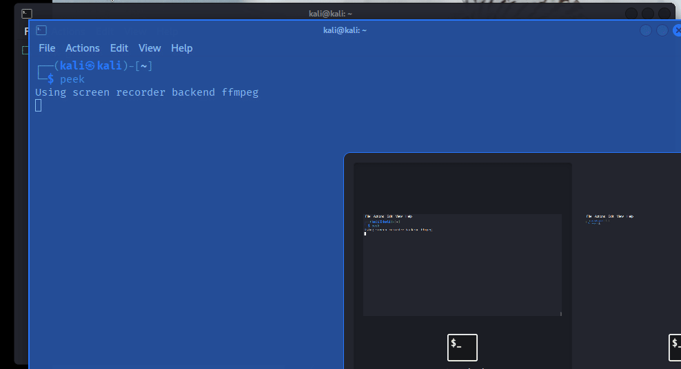

# Pentest Session Scripts — `newproj` & `newbox`

Personal reference doc for the two-tier pentest session management system.

Covers: what they do, how they fit together, how to use them, what they touch on disk, and where the extension points are.

---

## Demo




---

## Contents

- [Pentest Session Scripts — `newproj` \& `newbox`](#pentest-session-scripts--newproj--newbox)
  - [Demo](#demo)
  - [Contents](#contents)
  - [Overview](#overview)
  - [File locations](#file-locations)
  - [The two-tier model](#the-two-tier-model)
  - [`newproj.sh` — project level](#newprojsh--project-level)
    - [Usage](#usage)
    - [Flow](#flow)
    - [Default roots by lab type](#default-roots-by-lab-type)
  - [`Start-Session.sh` — box level (invoked as `newbox`)](#start-sessionsh--box-level-invoked-as-newbox)
    - [Usage](#usage-1)
    - [Flow (phase by phase)](#flow-phase-by-phase)
  - [State files](#state-files)
    - [`~/.pentest_env`](#pentest_env)
    - [`~/.current_project`](#current_project)
    - [`~/.current_workdir`](#current_workdir)
  - [Environment variables](#environment-variables)
  - [zshrc integration](#zshrc-integration)
  - [Multi-box workflow](#multi-box-workflow)
  - [Directory layouts produced](#directory-layouts-produced)
    - [Project root (after a few boxes)](#project-root-after-a-few-boxes)
    - [One box working directory](#one-box-working-directory)
    - [Parallel notes directory](#parallel-notes-directory)
  - [Template substitution](#template-substitution)
  - [Async terminal launcher — how it works](#async-terminal-launcher--how-it-works)
    - [Files involved (per job)](#files-involved-per-job)
    - [Steps](#steps)
    - [Waiting for completion](#waiting-for-completion)
  - [Extension notes](#extension-notes)
    - [Add a new lab type to `newproj`](#add-a-new-lab-type-to-newproj)
    - [Add new seeded directories or files in `newbox`](#add-new-seeded-directories-or-files-in-newbox)
    - [Add new template placeholders](#add-new-template-placeholders)
    - [Swap the apps that open on box start](#swap-the-apps-that-open-on-box-start)
    - [Change nmap scan params](#change-nmap-scan-params)
    - [AutoRecon tuning](#autorecon-tuning)
  - [Known caveats](#known-caveats)
  - [Troubleshooting](#troubleshooting)
  - [Reference commands](#reference-commands)

---

## Overview

A two-stage engagement container system for CTF / pentest work:

- **`newproj`** — run **once per engagement** (e.g. a lab series, an exam). Sets the "theatre of operations": lab type, project name, project root directory.
- **`newbox <IP>`** — run **once per target machine**. Creates the box directory tree, seeds files, populates note templates, fires nmap scans in parallel terminals, opens workspace apps, and exports the target's state into `~/.pentest_env` so every subsequent terminal inherits context.

Together they enforce a clean `project → box` hierarchy on disk and in shell state, with automatic per-box terminal logging handled by zshrc.

---

## File locations

| Item | Path |
|---|---|
| `newproj.sh` | `~/OSCP/CTFs/utils/newproj.sh` |
| `Start-Session.sh` | `~/OSCP/CTFs/utils/Start-Session.sh` |
| Wrapper functions | `~/.pentest_functions` (sourced by zshrc) |
| Env state file | `~/.pentest_env` |
| Project pointer | `~/.current_project` |
| Box pointer | `~/.current_workdir` |
| Templates source | `~/OSCP/CTFs/utils/PentestTemplates/` |
| Notes vault | `~/OSCP/CTFs/ctf_NOTES_obs/` |

---

## The two-tier model

```
┌────────────────────────────────────────────────────────────┐
│  newproj   →   ~/.pentest_env (project vars)               │
│                ~/.current_project                          │
│                                                            │
│    ┌───────────────────────────────────────────────────┐   │
│    │  newbox <IP>   →   ~/.pentest_env (+ box vars)    │   │
│    │                    ~/.current_workdir             │   │
│    │                    <BOX_DIR>/ (fresh tree)        │   │
│    │                    Notes dir (templates hydrated) │   │
│    │                    Nmap scans in new terminals    │   │
│    └───────────────────────────────────────────────────┘   │
│                                                            │
└────────────────────────────────────────────────────────────┘
```

One project holds many boxes. Project vars stay put. Box vars get overwritten each time `newbox` runs. All previous box *directories* remain intact on disk.

---

## `newproj.sh` — project level

### Usage

```bash
newproj
```

No arguments. Fully interactive.

### Flow

1. **Detects existing project** — if `~/.pentest_env` already has a `PENTEST_PROJECT_NAME` set, offers to keep it. Hitting Enter/`y` exits without changes.
2. **Prompts for lab type** — HTB / OffSec / OSCP Exam / ProLabs / Other. Sets `$PENTEST_LAB` and a default root dir.
3. **Prompts for project name** — e.g. `OSCP-Exam-4`, `HTB-Season6`.
4. **Prompts for project dir** — accepts the suggested default or a custom path. Creates it if missing (after confirmation).
5. **Backs up** the existing `~/.pentest_env` as `.bak.YYYYMMDD-HHMMSS`.
6. **Writes** a fresh `~/.pentest_env` with project-level vars filled and box-level vars blank.
7. **Writes** `~/.current_project` pointer.
8. **Sources** the env file for the current shell.

### Default roots by lab type

| Choice | `$PENTEST_LAB` | Default root |
|---|---|---|
| 1 | `HTB` | `/home/kali/HaX/HTB` |
| 2 | `OffSec` | `/home/kali/HaX/OffSec` |
| 3 | `OSCP-EXAM` | `/home/kali/HaX/OSCP-EXAM` |
| 4 | `ProLabs` | `/home/kali/HaX/ProLabs` |
| 5 | `Other` | `/home/kali/HaX/Other` |

---

## `Start-Session.sh` — box level (invoked as `newbox`)

### Usage

```bash
newbox <IP>
```

Requires a valid project (i.e. `newproj` must have run). Exits if not.

### Flow (phase by phase)

**Phase 1 — Validate project**
Sources `~/.pentest_env`, checks `$PENTEST_PROJECT_DIR` exists. Bails if missing.

**Phase 2 — Environmental setup**
- Detects `tun0` IP → `$LOCAL_IP`
- Prompts for sudo, spawns a 60-second keepalive loop (killed on exit via `trap`)
- Defines helper functions: `launch_terminal_script`, `start_sudo_job_with_terminal`, `wait_for_job`, `extract_open_ports`

**Phase 3 — Fire top-5000 TCP scan immediately**
```bash
nmap -vv -sS -sV -sC --top-ports 5000 -oN <tmp> <IP>
```
Runs in a **new terminal window** via the async launcher. Master script proceeds.

**Phase 4 — Collect box metadata (while scan runs)**
- Box name
- OS type → `W` / `L` / `U` prefix
- Domain (optional)

**Phase 5 — Build directories**

Working dir name:
```
<BOXNAME>-<OS_PREFIX>-<LAB>-<LAST_OCTET>
# e.g.  Nickel-W-HTB-5
```

Creates the tree plus seeded wordlists (see [Directory layouts produced](#directory-layouts-produced)).

**Phase 6 — Hydrate templates**
Copies every `.md` from `$TEMPLATE_DIR` into the notes dir and `sed`s placeholder tokens → real values. See [Template substitution](#template-substitution).

**Phase 7 — Persist box env vars**
Backs up `~/.pentest_env`, uses `sed -i` to overwrite box-level exports in place. Writes `~/.current_workdir`. Sources for current shell.

**Phase 8 — Open workspace apps**
- VS Code on `~/OSCP/CTFs`
- Obsidian on the notes vault
- Burp Suite
- `cd`s master terminal to `$PENTEST_PROJECT_DIR`

**Phase 9 — Wait for top-5000, launch full TCP scan**
Polls `.done` file. Moves report into `scans/`. Fires full `-p-` scan in another new terminal:
```bash
nmap -Pn -p- --min-rate 800 -vv -sC -sV -O --open ...
```

**Phase 10 — Optional AutoRecon**
Extracts open ports from the top-5000 output and seeds AutoRecon with `-p`. Prompts for launch. If yes → another new terminal.

**Phase 11 — Print UDP command & summary**
Doesn't run UDP (slow, noisy). Prints a ready-to-paste command. Final summary shows all paths and vars.

---

## State files

### `~/.pentest_env`

Sourced by every new terminal via zshrc (indirectly — via `~/.pentest_functions`). Written and overwritten by `newproj` and `newbox`.

```bash
# Project level (written by newproj, stable across boxes)
export PENTEST_PROJECT_NAME="HTB-Season6"
export PENTEST_PROJECT_DIR="/home/kali/HaX/HTB/HTB-Season6"
export PENTEST_LAB="HTB"

# Box level (written by newbox, overwritten each box)
export PENTEST_BOX_NAME="Nickel"
export PENTEST_BOX_DIR="/home/kali/HaX/HTB/HTB-Season6/Nickel-W-HTB-5"
export PENTEST_IP="10.10.10.5"
export PENTEST_DOMAIN=""
export PENTEST_OS="Windows"
export PENTEST_LOCAL_IP="10.8.0.42"
```

Backed up as `~/.pentest_env.bak.YYYYMMDD-HHMMSS` before any write.

### `~/.current_project`
Plain text. Contains path to active project dir. Used by shell functions for navigation.

### `~/.current_workdir`
Plain text. Contains path to active box dir. **Read by zshrc on every new terminal** to decide where to save session logs.

---

## Environment variables

| Variable | Set by | Purpose |
|---|---|---|
| `PENTEST_PROJECT_NAME` | `newproj` | Project label |
| `PENTEST_PROJECT_DIR` | `newproj` | Project root on disk |
| `PENTEST_LAB` | `newproj` | Lab type (HTB, OffSec, OSCP-EXAM, ProLabs, Other) |
| `PENTEST_BOX_NAME` | `newbox` | Current target box name |
| `PENTEST_BOX_DIR` | `newbox` | Current box working dir |
| `PENTEST_IP` | `newbox` | Current target IP (used everywhere) |
| `PENTEST_DOMAIN` | `newbox` | AD domain (optional) |
| `PENTEST_OS` | `newbox` | Windows / Linux / Unknown |
| `PENTEST_LOCAL_IP` | `newbox` | Attacker tun0 IP |

---

## zshrc integration

The `/etc/zsh/zshrc` auto-logs every interactive shell to the active box's notes directory:

```bash
CURRENT_DIR_FILE="${HOME}/.current_workdir"

if [[ -z "${UNDER_SCRIPT}" && -f "$CURRENT_DIR_FILE" ]]; then
    WORK_DIR=$(cat "$CURRENT_DIR_FILE")
    BOXNAME=$(basename "$WORK_DIR")
    NOTES_DIR="${HOME}/OSCP/CTFs/ctf_NOTES_obs/${BOXNAME}"
    NEW_LOG_FILE="${NOTES_DIR}/terminal-session-$(date +%F.%H-%M-%S).$$.log"
    export UNDER_SCRIPT="$NEW_LOG_FILE"
    exec script -f -q "$NEW_LOG_FILE"
fi
```

Mechanism:
- Each new shell checks `~/.current_workdir`
- Derives the box name from that path
- Wraps itself in `script -f -q` pointing at a per-session log in the notes dir
- `UNDER_SCRIPT` env var prevents recursive re-wrapping

The `tmuxbox` alias unsets `UNDER_SCRIPT` before launching tmux so the wrapper runs inside tmux panes too.

---

## Multi-box workflow

Intended pattern across a single project session:

```bash
newproj                  # Once per engagement. Choose lab, name, dir.
newbox 10.10.10.5        # Box 1 — Nickel
# ... work, exploit, root ...

newbox 10.10.10.12       # Box 2 — Iron
# box vars overwritten, new dir created under same project

newbox 10.10.10.23       # Box 3 — Copper
# same again
```

What each `newbox` call does to state:

| State | Effect |
|---|---|
| Project vars in `~/.pentest_env` | **Preserved** |
| Box vars in `~/.pentest_env` | **Overwritten** |
| Previous box directory on disk | **Untouched** |
| Previous notes dir | **Untouched** |
| `~/.pentest_env` backup | **Created** with timestamp |
| `~/.current_workdir` | **Updated** to new box |

So `$PENTEST_IP` always reflects the currently active target. All prior box work remains intact on disk.

---

## Directory layouts produced

### Project root (after a few boxes)

```
/home/kali/HaX/HTB/HTB-Season6/
├── Nickel-W-HTB-5/
├── Iron-L-HTB-12/
└── Copper-W-HTB-23/
```

### One box working directory

```
<BOXNAME>-<OS>-<LAB>-<OCTET>/
├── enum/
├── foothold/
├── loot/
│   ├── hashes/
│   └── creds/
├── privesc/
├── scans/
│   ├── nmap_0_top5000.nmap        ← top-5000 report (moved here post-scan)
│   ├── PortFull-Pn.nmap           ← full TCP scan
│   ├── PortFull-Pn.gnmap
│   ├── UDP-top1000.nmap           ← only if you run the UDP cmd manually
│   └── <IP>-autorecon/            ← if AutoRecon launched
├── users.txt                      ← seeded: admin, root, test, guest, boxname
├── passwords.txt                  ← seeded similarly + domain
├── ContextWordlist.txt            ← seeded with box name
└── foo.txt                        ← placeholder
```

### Parallel notes directory

```
~/OSCP/CTFs/ctf_NOTES_obs/<BOXNAME>-<OS>-<LAB>-<OCTET>/
├── 00_RECON_OVERVIEW.md
├── 01_Network_Scanning.md
├── 02_Web_Enumeration.md
├── 03_AD_External.md
├── 04_Service_Specific.md
├── ... (all templates, placeholders substituted)
└── terminal-session-*.log         ← appended by zshrc auto-logger
```

---

## Template substitution

On box creation, every `.md` in `$TEMPLATE_DIR` is copied to the notes dir and run through `sed`:

| Placeholder | Replaced with |
|---|---|
| `IP_ADDRESS` | `$IP` |
| `LOCAL_IP` | `$LOCAL_IP` (tun0) |
| `DOMAIN` | `$DOMAIN` (or literal `DOMAIN` if blank) |
| `BOXNAME` | `$BOXNAME` |
| `OS_TYPE` | `Windows` / `Linux` / `Unknown` |
| `LAB_TYPE` | `$PENTEST_LAB` |

Tokens are substituted globally (`sed -i -e "s|...|...|g"`) so they can appear anywhere in template files — in code blocks, URLs, headings.

---

## Async terminal launcher — how it works

This is the core mechanism for "fire nmap in a new window, don't block the master terminal". Used three times in `Start-Session.sh` (top-5000, full TCP, AutoRecon).

### Files involved (per job)

| File | Purpose |
|---|---|
| `/tmp/session-job.XXXXXX.sh` | The actual command to run |
| `/tmp/session-view.XXXXXX.sh` | Viewer script that `tail -f`s the log |
| `/tmp/<job>-*.log` | Live output stream |
| `/tmp/<job>-*.done` | Completion marker |
| `/tmp/<job>-*.status` | Exit code of the job |

### Steps

1. Write the command to a temp bash script that captures its exit status and touches the `.done` file when complete.
2. Run it via `nohup sudo -n script -qefc ...` pointed at the log file. `script` is used for PTY allocation so nmap's progress output renders correctly.
3. Write a second temp script (the "viewer") that:
   - Prints a header
   - `tail -f`s the log file
   - Polls for `.done`, then prints the exit code and drops to an interactive shell
4. Launch a new terminal emulator running the viewer. Tries `gnome-terminal`, `xfce4-terminal`, `konsole`, `x-terminal-emulator` in order.

### Waiting for completion

`wait_for_job()` in the master script polls the `.done` file every 5 seconds, printing dots. When it appears, reads `.status` for the exit code, returns it.

This is how the master terminal synchronises with the async-launched jobs — it knows exactly when each scan finishes, even though the scans run in their own windows.

---

## Extension notes

Places where this system can be extended cleanly:

### Add a new lab type to `newproj`

1. Add a new root constant at the top:
   ```bash
   BUGBOUNTY_ROOT="/home/kali/HaX/BugBounty"
   ```
2. Add it to the menu:
   ```bash
   echo "    6) Bug Bounty"
   ```
3. Add the case:
   ```bash
   6) LAB="BugBounty"; DEFAULT_ROOT="$BUGBOUNTY_ROOT" ;;
   ```

### Add new seeded directories or files in `newbox`

Phase 5 in `Start-Session.sh`:
```bash
mkdir -p "$BOX_WORK_DIR"/{enum,foothold,loot,privesc,scans,loot/hashes,loot/creds}
```
Add subdirs here. Add to the seeded-file loop below if you want them pre-populated.

### Add new template placeholders

In Phase 4 of `Start-Session.sh` find the sed block:
```bash
sed -i \
    -e "s|IP_ADDRESS|${IP}|g" \
    -e "s|LOCAL_IP|${LOCAL_IP}|g" \
    ...
```
Add a new `-e` line. Then use the placeholder in your template `.md` files.

### Swap the apps that open on box start

Phase 6 of `Start-Session.sh`:
```bash
open_vscode "$CTF_ROOT_DIR"
open_obsidian
open_burpsuite
```
Add or remove. Each is a defined function earlier in the script — model new ones on `open_burpsuite()`.

### Change nmap scan params

Two places:

Top-5000 (Phase 3):
```bash
BOOTSTRAP_CMD="nmap -vv -sS -sV -sC --top-ports 5000 -oN \"$BOOTSTRAP_TMP_OUT\" \"$IP\""
```

Full TCP (Phase 8):
```bash
NMAP_CMD="nmap -Pn -p- --min-rate 800 -vv -sC -sV -O --open -oN \"$NMAP_OUT\" -oG \"$GNMAP_OUT\" \"$IP\""
```

### AutoRecon tuning

Top of `Start-Session.sh`:
```bash
DIRBUSTER_WORDLIST="/usr/share/wordlists/dirb/common.txt"
DIRBUSTER_THREADS=100
DIRBUSTER_RECURSIVE=true
AUTORECON_HEARTBEAT=30
AUTORECON_NMAP_APPEND="--min-rate 500 --max-retries 4"
```

---

## Known caveats

- **No explicit "close box" step.** Running `newbox <IP>` on a new target just overwrites the old box vars. To jump back to a previous box's context you'd need to re-run `newbox` on it (rebuilds the dir — not ideal) or manually restore from a `.pentest_env.bak.*` file.
- **`sed -i` box var overwrites assume the lines exist.** If `~/.pentest_env` is edited manually and the `PENTEST_BOX_*` lines are removed, the `sed` in Phase 7 silently does nothing. Vars stay blank. If this happens, delete `~/.pentest_env` and re-run `newproj` + `newbox`.
- **Terminal emulator fallback order is fixed.** Tries gnome-terminal, xfce4-terminal, konsole, x-terminal-emulator. If none are installed, async launches fail but jobs still run in the background — just no visible window.
- **`tun0` dependency.** If VPN isn't up, `$LOCAL_IP` is set to the literal string `LOCAL_IP` as a marker. Templates will contain that string until VPN comes up and you regenerate manually.
- **Sudo keepalive leaks on SIGKILL.** The `trap` handles normal exits, but if the script is `kill -9`'d the keepalive loop survives. Check with `pgrep -f "sudo -n true"` if suspicious.
- **No lockfile.** Running `newbox` twice in parallel races on `~/.pentest_env`. Don't do it.

---

## Troubleshooting

**`newbox` says no active project, but I just ran `newproj`**
Check `~/.pentest_env` exists and `$PENTEST_PROJECT_DIR` is set. Sometimes a sourcing issue — open a fresh terminal.

**Terminal auto-logging not triggering**
Check `~/.current_workdir` exists and points to a valid box dir. Check `UNDER_SCRIPT` is not already set in the parent shell.

**Nmap output not moving into `scans/` after top-5000**
Check `/tmp/nmap-bootstrap-*.nmap` exists — if the scan crashed, there's nothing to move. Look at the corresponding `.log` for the failure.

**AutoRecon command too long / needs editing**
Copy the printed command from the summary, decline the auto-launch prompt, edit, paste into a new terminal manually.

**Templates not substituting — placeholders remain literal**
Confirm `$TEMPLATE_DIR` exists and contains `.md` files. Confirm placeholders in templates are written exactly as expected (case-sensitive: `IP_ADDRESS` not `ip_address`).

---

## Reference commands

```bash
# Start a new engagement
newproj

# Create a box within the engagement
newbox 10.10.10.5

# Jump around
gobox                          # → $PENTEST_BOX_DIR
goproj                         # → $PENTEST_PROJECT_DIR

# Inspect current state
cat ~/.pentest_env
cat ~/.current_workdir
cat ~/.current_project

# Recover prior project state
ls -la ~/.pentest_env.bak.*
cp ~/.pentest_env.bak.20260418-135900 ~/.pentest_env
source ~/.pentest_env
```